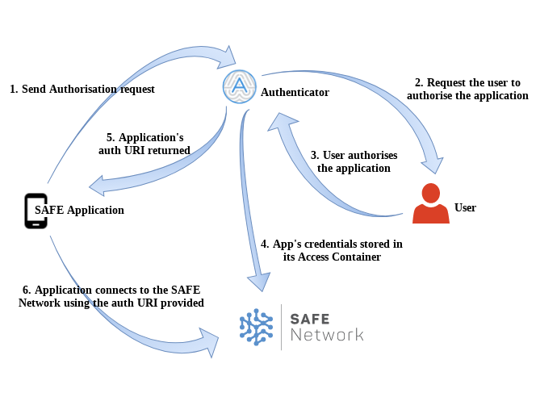

# safe_app_nodejs

A [safe_app](https://github.com/maidsafe/safe_client_libs) language binding for [Node.js](https://nodejs.org/).

**Maintainer:** Gabriel Viganotti (gabriel.viganotti@maidsafe.net)

|Linux/macOS|Windows|Coverage Status|
|:---:|:---:|:---:|
|[](https://travis-ci.com/maidsafe/safe_app_nodejs)|[](https://ci.appveyor.com/project/MaidSafe-QA/safe-app-nodejs/branch/master)|[](https://coveralls.io/github/maidsafe/safe_app_nodejs)|


## Table of contents
1. [High level overview](#high-level-overview)
2. [The API](#the-api)
    * [API detailed documentation](#api-detailed-documentation)
    * [Experimental APIs](#experimental-apis)
3. [The internal FFI layer](#the-internal-ffi-layer)
4. [Codebase structure](#codebase-structure)
5. [Using this package as a dependency](#using-this-package-as-a-dependency)
6. [Development](#development)
7. [Contributing](#contributing)
    * [Project board](#project-board)
    * [Issues](#issues)
    * [Commits and Pull Requests](#commits-and-pull-requests)
    * [Releases and Changelog](#releases-and-changelog)
    * [Copyrights](#copyrights)
8. [Further Help](#further-help)
9. [License](#license)

## High level overview

The safe_app_nodejs package is a Node.js binding for the [safe_app](https://github.com/maidsafe/safe_client_libs) Rust library which is needed by any desktop application to connect and read/write data on [The SAFE Network](https://safenetwork.tech).

Any Node.js application can make use of this package to be able to not only read/write data on the SAFE Network but also to send/receive authorisation requests to the SAFE Authenticator (see https://hub.safedev.org/discover for additional info of the Authenticator).



At a very high level, this package contains three layers:
- the API, the majority of its functions and functionality is a 1-to-1 mapping to the FFI API exposed by the underlying `safe_app` Rust library
- an internal middle abstraction layer which mediates between the implementation of the JavaScript API and the lower FFI interface, mostly dealing with how to map FFI data and structures to/from JS objects
- FFI interface layer which makes use of [Node-FFI package](https://github.com/node-ffi/node-ffi) to invoke the FFI API exposed by the `safe_app` Rust library, sending and receiving data

## The API

As mentioned above, the `safe_app_nodejs` API is in its majority a 1-to-1 mapping to the FFI API exposed by the `safe_app` Rust library. Currently, at a high level, the following are the main areas covered by the API:
- The `webFetch` function ([/src/web_fetch.js](/src/web_fetch.js)):
It implements the public name resolution system (a.k.a. Decentralised Name System or Public Name System) allowing to fetch content from the network using human readable URLs in the form `safe://<subName>.<publicName>/<path>`
- Authorisation, and system URI utilities ([/src/api/auth.js](/src/api/auth.js)):
Functions to generate authorisation requests, send them to the Authenticator, as well as receive the corresponding authorisation response and decode them.
- Default Containers ([/src/api/app.js](/src/api/app.js)):
Utilities to read/write data form/onto the default containers provided with each SAFE account
- Private/Public MutableData and ImmutableData ([/src/api/mutable.js](/src/api/mutable.js) and [/src/api/immutable.js](/src/api/immutable.js)):
Mutable and Immutable data is currently supported by the SAFE Network, a set of functions is exposed to manipulate these type of data for read and write access
- NFS emulation ([/src/api/emulations/nfs.js](/src/api/emulations/nfs.js)):
An API which emulates the way files are manged by NFS allowing apps to store and read files which are organised with a hierarchy using absolute paths
- Cryptographic utilities ([/src/api/crypto.js](/src/api/crypto.js)):
A set a utilities to generate and use sign & encryption key pairs
- Network connection management ([/src/api/app.js](/src/api/app.js)):
As a complement to the utilities needed for apps authorisation, there are also a few functions required to connect to the network, and reconnect upon a disconnection event is detected
- Experimental APIs:
Early stage API/functions are also exposed, see section [Experimental APIs](#experimental-apis) below for more details.

### API detailed documentation

The documentation for the latest `safe_app_nodejs` API is published at <http://docs.maidsafe.net/safe_app_nodejs/>. If you are otherwise using a previous version of this package, you can also generate the API docs locally. Make sure you first install this package's dependencies with `yarn`, then execute the following command:
```bash
yarn docs
```

The documentation for the API is generated using [jsdoc](https://github.com/jsdoc3/jsdoc). The source code of the `safe_app_nodejs` package has comments embedded which can then be scanned by `jsdoc` script to automatically generate the HTML documentation website/webpages.

The API docs will be generated under the `docs` folder, you can simply open the `docs/index.html` file with your default browser.


### Experimental APIs

Users and developers are welcome to use any of the experimental APIs to explore the features that are being actively designed and developed.

Although they should be aware of the fact that all/any of the experimental APIs may be changed, deprecated, or even removed in the future, and without much anticipated notification by the core developers.

The reason they are exposed is to just allow developers to experiment and start learning about the APIs at an early stage.

In order to enable the experimental APIs the `--enable-experimental-apis` flag needs to be provided when running the application that depends on this package, or alternatively, the `enableExperimentalApis` flag can be set to true in the initialisation options.

When any of the experimental APIs is called by an application, a warning message like the following will be logged in the console:
```
** Experimental API WARNING **
* The application is making use of a safe-node-app experimental API *
The '<function/feature name>' is part of a set of experimental functions.
Any/all of them may be deprecated, removed, or very likely changed in the future.
Also regular users won't have this APIs enabled by default unless the flag is provided, so be aware of all these limitations.
For more information, updates, or to submit ideas and suggestions, please visit https://github.com/maidsafe/safe_app_nodejs
```

Currently the following experimental APIs/functionality are exposed:
- Obtain XOR-URLs:
XOR-URLs can be obtained for any ImmutableData and MutableData on the network (see `getNameAndTag` function for MDs, and the `close` function in the ImmutableData writer API, respectively)
- The `fetch` function (also within [/src/web_fetch.js](/src/web_fetch.js)):
Apart from the `webFetch` function which can be used to retrieve content compatible for an HTTP client, like the browser, it is also possible to use the `fetch` function for retrieving a MutableData or ImmutableData from a URL (either XOX or publicName URL), and be able to use the MD/IMMD API to manipulate it e.g. for mutating entries in a MutableData fetched with a URL
- RDF Emulation ([/src/api/emulations/rdf.js](/src/api/emulations/rdf.js)):
It allows applications to create and manipulate data in RDF format. Using this API the applications can see data as RDF triples. The API takes care of then storing the data on the network, and the developer doesn’t need to worry about how to serialise/format it to store it or fetch it from the Network.
- WebID ([/src/api/emulations/web_id.js](/src/api/emulations/web_id.js)):
Abstraction for creating/updating WebIDs on the SAFE Network, even allowing the application to publish them with a publicName-URL ("safe://..."). Analogously to the RDF APIs, the developer doesn’t need to take care of either the serialisation for the data or how to fetch and/or store the WebIDs on the network

## The internal FFI layer

As explained above the `safe_app_nodejs` is just a Node.js binding for the `safe_app` Rust library, which is required by any SAFE app to connect and access data on the SAFE Network.

The `safe_app_nodejs` also depends on the [system_uri Rust library](https://github.com/maidsafe/system_uri) to allow Node.js applications to register a system URI scheme required to interact with the SAFE Authenticator to send/receive authorisation requests/responses.

The `safe_app` Rust library exposes an interface which can be consumed from ant other programming language, this is achieved by the use of the [Rust FFI feature](https://doc.rust-lang.org/book/ch19-01-unsafe-rust.html#using-extern-functions-to-call-external-code).

This package makes use of the `safe_app` FFI through the [Node-FFI library](https://github.com/node-ffi/node-ffi), which allows Node.js code to be able to invoke the functions exposed and implemented by the `safe_app` Rust library, sending and retrieving data from the SAFE Network through it.

The `safe_app` library is downloaded when the `safe_app_nodejs` is installed (with `yarn` or `npm`), this is done by a [dependency downloader tool](https://github.com/maidsafe/deps_downloader) we maintain, which is inspired by electron-download. This tool downloads assets and libraries on demand for the specific platform, i.e. it will download `libsafe_app.so` (on Linux), `safe_app.dll` (on Windows), or `libsafe_app.dylib` (on OSX) accordingly.

Once the `safe_app_nodejs` package is installed, and the corresponing `safe_app` native library was downloaded, the Node-FFI `DynamicLibrary` function is used to load the shared library and start creating the JavaScript bindings (you can refer to this [node-ffi tutorial](https://github.com/node-ffi/node-ffi/wiki/Node-FFI-Tutorial) for some more info).

Analogous to how this package interfaces with the `safe_app` FFI, the `system_uri` library API is also consumed through the `node-ffi` package and downloaded with the `deps_downloader`.

## Codebase structure

The source code files structure is very simple, at the root there are only three main folders:

### /src

This is where all the source code for the actual implementation of the Node.js language binding resides.

#### /src/api

This is the main folder with the implementation of the top level classes and public API. E.g. the [/src/api/auth.js](/src/api/auth.js) has the implementation of the `AuthInterface` class which exposes the authorisation related functions in the API.

#### /src/native

As explained above, the `safe_app_nodejs` package has an internal layer which takes care of the FFI to interface with the underlying `safe_app` native library. All the files belonging to the internal FFI layer are located in the [/src/native](/src/native) folder.

### /test

All the automated unit tests using [Mocha](https://mochajs.org) are within this folder and organised in subfolders according to the feature/functionality each of them test. See [Testing section](#esting) below for more details.

### /examples

There are also a few standalone example applications showcasing the use of `safe_app_nodejs` API, they can be found at [/examples/standalone](/examples/standalone). You can also see the [README](examples/standalone/README.md) for information about these example applications an how to execute them.

## Using this package as a dependency

Each release of this package is published in [https://www.npmjs.com/package/@maidsafe/safe-node-app](https://www.npmjs.com/package/@maidsafe/safe-node-app), you can add it as a dependency to your project with either
```bash
npm i @maidsafe/safe-node-app
```
or
```bash
yarn add @maidsafe/safe-node-app
```

## Development

1. Prerequisites

    * [Node.js](https://nodejs.org) ^10.0.0 (we recommend installing it via [nvm](https://github.com/creationix/nvm))
    * [Git](https://git-scm.com/)
    * [Yarn](https://yarnpkg.com) (as a replacement for `npm`).
    * Windows-specific:
      - Yarn attempts to build modules concurrently with multiple child processes, which causes intermittent timing issues on Windows. Users need to run `yarn config set child-concurrency 1` just once to effect local yarn settings.
      - In order to be able to build native Node modules for this library, run `npm install --global --production windows-build-tools` which installs Python 2.x, Visual Studio 2015 build tools, and Visual C++ build tools.

2. Clone this GitHub repository:

    ```bash
    git clone https://github.com/maidsafe/safe_app_nodejs.git
    ```

3. Install the dependencies:

    ``` bash
    cd safe_app_nodejs
    yarn
    ```
#### Testing

To run the tests locally, run `yarn test`.

Note: If you are compiling your own [`safe_app`](https://github.com/maidsafe/safe_client_libs/tree/master/safe_app) library for testing purposes, and if you want to be able to run the tests, make sure to include `testing` in your build features when compiling `safe_app` in `safe_client_libs`, i.e. `cargo build --release --features "use-mock-routing testing"`.

#### Mobile Development

If you do not require [system_uri](https://github.com/maidsafe/system_uri) and would like to prevent it from downloading, first set `NODE_ENV` environment variable to either `mobile_prod` or `mobile_dev` before running `yarn`.

## Contributing

As an open source project we're excited to accept contributions to the code from outside of MaidSafe, and are striving to make that as easy and clean as possible.

With enforced linting and commit style clearly layed out, as well as a list of more accessible issues for any project labeled with `Help Wanted`.

This project adheres to the [Contributor Covenant](https://www.contributor-covenant.org/). By participating, you are expected to honor this code.

### Project board

GitHub project boards are used by the maintainers of this repository to keep track and organise development priorities.

There could be one or more active project boards for a repository. One main project will be used to manage all tasks corresponding to the main development stream (`master` branch). E.g. https://github.com/maidsafe/safe_app_nodejs/projects/1. A separate project may be used to manage each PoC and/or prototyping development, and each of them will track a dedicated development branch.

New features which imply big number of changes will be developed in a separate branch but tracked in the same main project board, re-basing it with `master` branch regularly, and fully testing the feature on its branch before it's merged onto the master branch after it was fully approved.

The main project contains the following Kanban columns to track the status of each development task:
- `Needs Triage`: new issues which need to be reviewed and evaluated to decide priority
- `Low Priority`: not required for the very next milestone
- `High Priority`: required for the very next milestone, or a subsequent one according to circumstances
- `In Progress`: task is assigned to a person and it's in progress
- `Needs Review`: a Pull Request which completes the task has been sent and it needs to be reviewed
- `Approved by Reviewer`: the PR sent was approved by reviewer/s and it's ready for merge
- `Closed`: PR associated to the issue was merged (or task was completed by any other means)

### Issues

Issues should clearly lay out the problem, platforms experienced on, as well as steps to reproduce the issue.

This aids in fixing the issues but also quality assurance, to check that the issue has indeed been fixed.

Issues are labeled in the following way depending on its type:
- `bug`: the issue is a bug in the product
- `feature`: the issue is a new and inexistent feature to be implemented in the product
- `enhancement`: the issue is an enhancement to either an existing feature in the product, or to the infrastructure around the development process of the product
- `blocked`: the issue cannot be resolved as it depends on a fix in any of its dependencies
- `good first issue`: an issue considered more accessible for any developer trying to start contributing

### Commits and Pull Requests

We use [Conventional Commit](https://www.conventionalcommits.org/en/v1.0.0-beta.3/) style messages. (More usually [with a scope](https://www.conventionalcommits.org/en/v1.0.0-beta.3/#commit-message-with-scope)) for commits.

Commits should therefore strive to tackle one issue/feature, and code should be pre-linted before commit.

PRs should clearly link to an issue to be tracked on the project board. A PR that implements/fixes an issue is linked using one of the [GitHub keywords](https://help.github.com/articles/closing-issues-using-keywords). Although these type of PRs will not be added themselves to a project board (just to avoid redundancy with the linked issue). However, PRs which were sent spontaneously and not linked to any existing issue will be added to the project and should go through the same process as any other tasks/issues.

Where appropriate, commits should _always_ contain tests for the code in question.

### Releases and Changelog

The change log is currently maintained manually, each PR sent is expected to have the corresponding modification in the [CHANGELOG](CHANGELOG.MD) file, under the ['Unreleased' section](CHANGELOG.MD#unreleased). We are planning to start using [standard-version](https://www.npmjs.com/package/standard-version) shortly for maintaining the changelog.

The release process is triggered by the maintainers of the package, by bumping the package version according to the [SemVer](https://semver.org/) spec, and pushing a tag to have our Travis CI scripts to automatically create the new version of `@maidsafe/safe-node-app` package and publish it at [https://www.npmjs.com/package/@maidsafe/safe-node-app](https://www.npmjs.com/package/@maidsafe/safe-node-app)

### Copyrights

Copyrights in the SAFE Network are retained by their contributors. No copyright assignment is required to contribute to this project.

## Further Help

You can discuss development-related questions on the [SAFE Dev Forum](https://forum.safedev.org/).
If you are just starting to develop an application for the SAFE Network, it's very advisable to visit the [SAFE Network Dev Hub](https://hub.safedev.org) where you will find a lot of relevant information, including a [tutorial to create an example SAFE desktop application](https://hub.safedev.org/platform/nodejs) which makes use of this package.

## License

This SAFE Network library is dual-licensed under the Modified BSD ([LICENSE-BSD](LICENSE-BSD) https://opensource.org/licenses/BSD-3-Clause) or the MIT license ([LICENSE-MIT](LICENSE-MIT) https://opensource.org/licenses/MIT) at your option.
